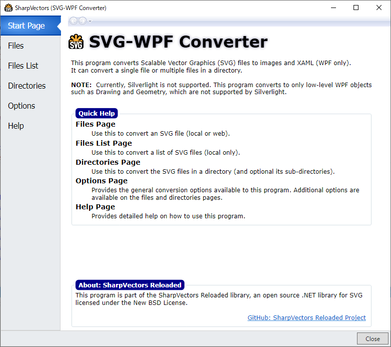
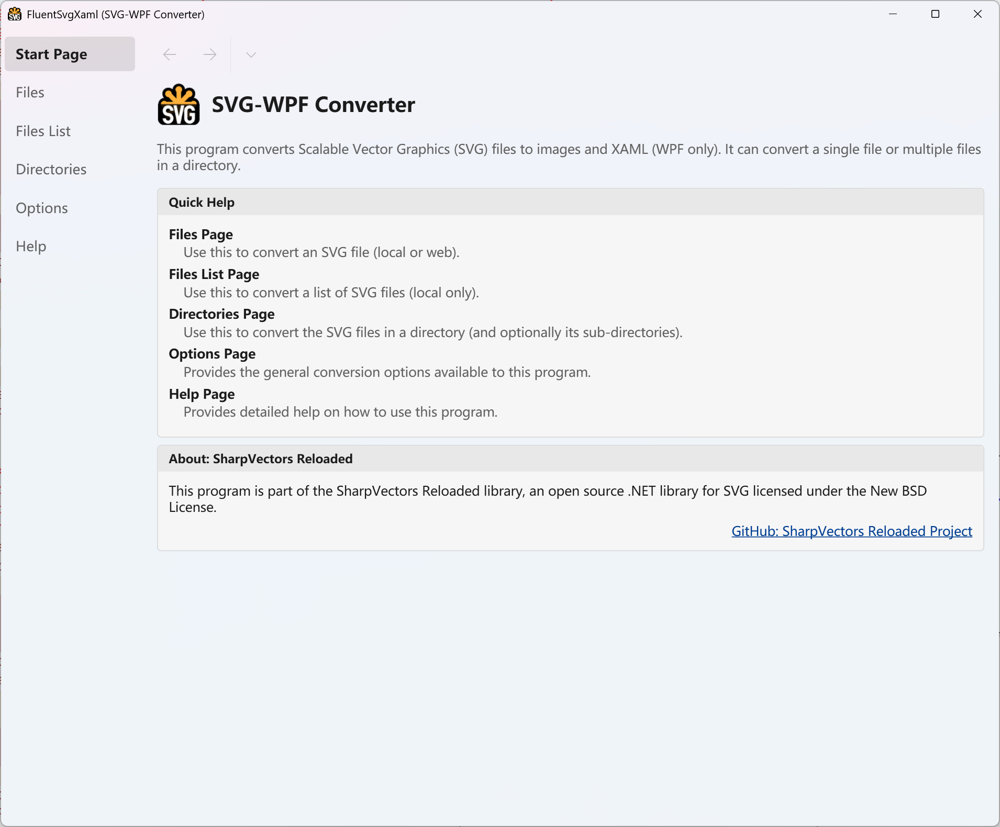

# FluentSvgXaml

Forked from [ElinamLLC/SvgXaml](https://github.com/ElinamLLC/SvgXaml).

[SharpVectors](https://github.com/ElinamLLC/SharpVectors/) based application for converting SVG to XAML files.
It converts a single SVG file, multiple SVG files and directory of SVG files to XAML for WPF applications.

 

## Requirements

* WPF
* .NET 10
* C# 14

## Build

```bash
dotnet build FluentSvgXaml.slnx
```
